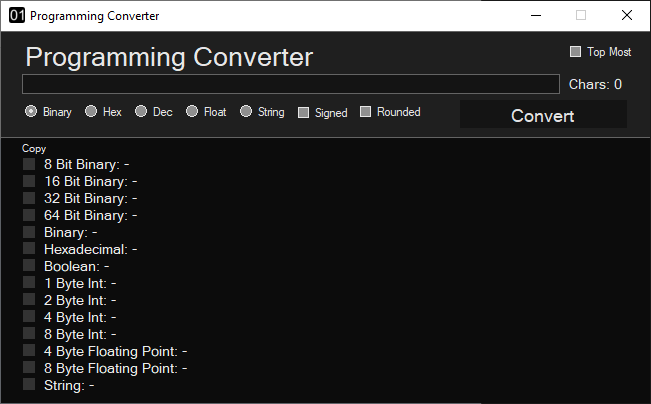

# Programming-Converter

A C++ app that will convert from and to various types useful for programming. 

Features:
  -Convert from:
    -Binary
    -Hexadecimal
    -Floating-point
    -String
  -Convert to:
    -8 bit binary
    -16 bit binary
    -32 bit binary
    -64 bit binary
    -Unrestricted size binary (will use minimum bits needed to represent the input)
    -Hexadecimal
    -Boolean
    -1 byte int
    -2 byte int
    -4 byte int
    -8 byte int
    -Float
    -Double
    -String
  -Convert from/to signed variations
  -Round floats to any place
  

  
Made with C++/CLR
https://marketplace.visualstudio.com/items?itemName=RichardKaiser.CppWinformsVS2019VSIX001
