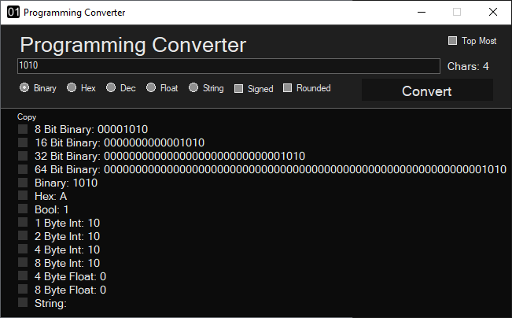
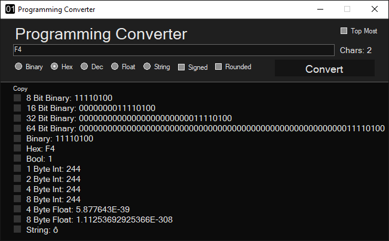
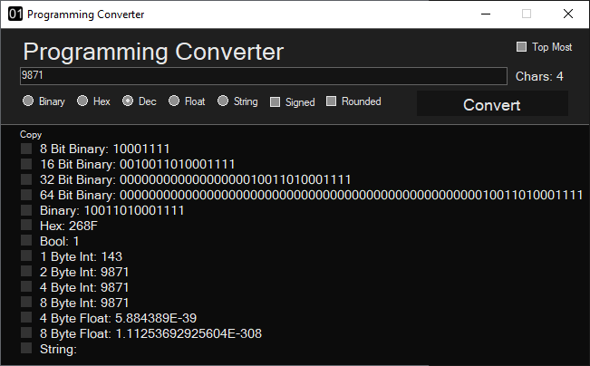
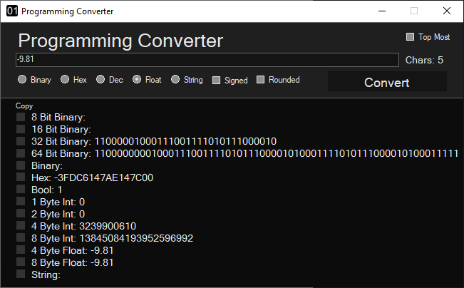
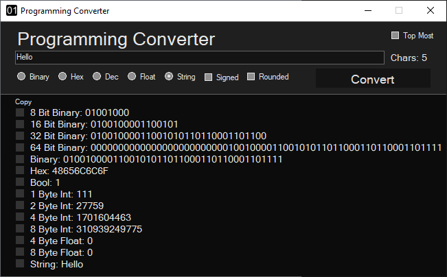
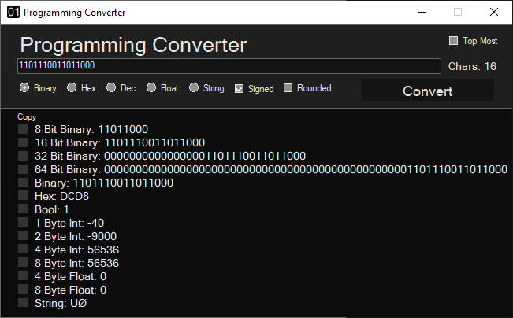
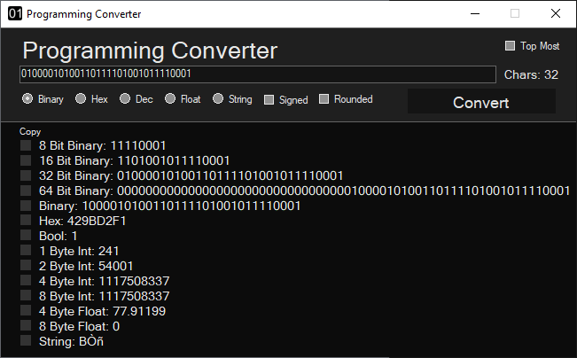
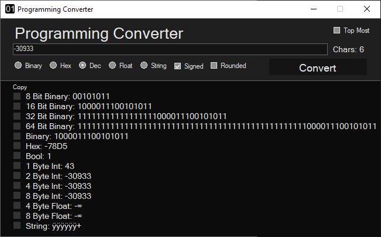
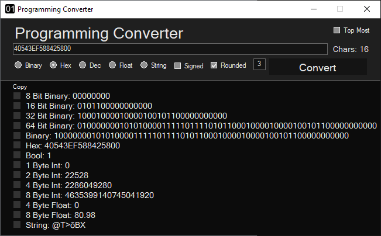

# Programming-Converter

A C++ app that will convert from and to various types useful for programming. 

<pre>
Features:
  1. Convert from:
    - Binary
    - Hexadecimal
    - Floating-point
    - String
  2. Convert to:
    - 8 bit binary
    - 16 bit binary
    - 32 bit binary
    - 64 bit binary
    - Unrestricted size binary (will use minimum bits needed to represent the input)
    - Hexadecimal
    - Boolean
    - 1 byte int
    - 2 byte int
    - 4 byte int
    - 8 byte int
    - Float
    - Double
    - String
  3. Convert from/to signed variations
  4. Round floats to any place
</pre>

  
Made with C++/CLR
https://marketplace.visualstudio.com/items?itemName=RichardKaiser.CppWinformsVS2019VSIX001
